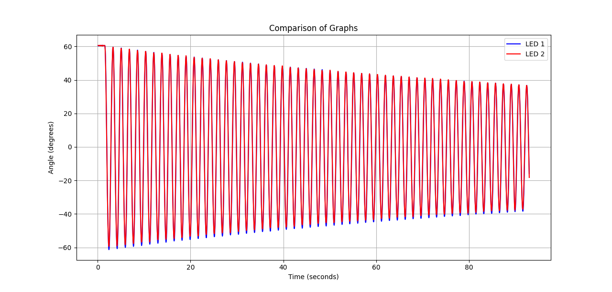
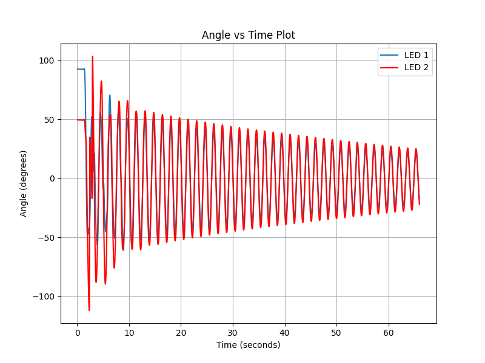

 # Content
 - [Overview](#overview)
 - [Video Processing](#video-processing)
    - [Motivation](#motivation)
    - [Dev Process](#dev-process)
        - [Start](#start)
        - [Decoding Chaotic Tracking ](#decoding-chaotic-tracking)
            - [Color Differentiation](#color-differentiation)
            - [Previous Frame Proximity](#previous-frame-proximity)
        - [Camera Setting](#camera-setting)
    - [How to Use the Code](#how-to-use-the-code)
 - [Simulation](#simulation)
 - [Poster](#poster)
 - [Credits](#credits)

# Overview  
In Intermediate Physics Laboratory (2025) we have a project to analyze a chaotic pendulum system. The MATLAB code given to us for tracking LEDs in a video was broken, old, and quite frankly bad, so we developed a new solution using openCV and other python libraries. If you are a future group doing this lab and hope to code something cool, consider forking this repository!  
# Video Processing  
## Motivation  
We first decided to make a tracking solution when we tried using the provided MATLAB code and realized it didn't work or make any sense.  
Primarily the goal was to use python, a language we were previously familiar with, to create a code that could be used by groups in the future with minimal assumptions of their physical set up.  
## Dev Process  
### Start  
First we researched libraries and found the obvious choice of openCV, then we got to work setting up a identification of the LEDs in a static image (the first frame of the video we took).  
We then got it working for the entire video of the physical pendulum, hard coding the differentiation of which LED is LED 1 and which is LED 2 by the distance away from pivot (since the distance is constant for the physical pendulum). To be clear, LED 1 is always the one in the middle of the pendulum, LED 2 at the very end of the pendulum, at least in our code.  
### Decoding Chaotic Tracking  
Entending to the chaotic double pendulum, the code for LED differentiation no longer worked, because LED 2 is often closer to the pivot than LED 1. We needed a new way to differentiate between the LEDs, we brainstormed and came up with two new ideas, LED color differentiation and previous frame proximity.  
#### Color Differentiation  
The idea for the color differentiation (which our code does not use) was hard, since when we were developing this, our LEDs were blue and green, and the RGB values read by computer vision were too similar and varied too much frame to frame, often resulting in the green LED having a greater blue value than the blue LED.  
Also another issue we had to tackle was that the center of the LED was read as white (since they're so bright on the video) so we had to average the RGB value of neighboring pixels to the center of the LED.  
Then we explored the HSV system, thinking maybe we could differentiate based off hue of the sampled color, but again the values were too inconsistent and similar to differentiate on computer vision.  
We also didn't like this approach because it would lock future users of the code into having a green and blue LED, needing to change the color in the code if that wasn't possible.  
#### Previous Frame Proximity  
This idea was great, it instantly made our code identify them a lot better. Basically we just save a temp variable of the last frame's location of LED 1 and LED 2 and say that if the new location is closest to LED 1 then this LED is LED 1, same for LED 2.  
For some reason this method of differentiation would break down in a singular edge case frame and we didn't know why, so the next step we made was to combine the initial idea of differentiating by radius from the pivot and this new previous frame proximity approach.  
This resulted in a very low error in the tracking, but the next thing we did to get the error even lower was not related to code at all.  
### Camera Setting  
Going in we had zero camera experience, so we got it to turn on, put everything on auto, and just took a video. After talking to friends about this project it became clear that auto is NOT good for this project. Turning the aperture down made it so the background had a very low grey scale value (0-255, 0 is black, 255 is white), while the LEDs were the only thing above about 140. This simple change decreased the error in computer vision by a drastic amount.  
Also as a litte note, if you see a reflection of the LEDs in the video (from the camera lense), don't worry about it, it shouldn't be detected by the code.  
## How to Use the Code  
The basic most surface level interfacing with the code is simply sticking to lines 7-11. Change the name of the video (don't include the file type there), change all the paths to fit your local device, keeping in mind the comments in the code. **Adjust the brightness values if and only if the computer vision detection of the LEDs is spotty**, use value like 140 for low aperture videos, use values really high like 245 for videos taken on auto or high aperture. This value is largely guess and check, I couldn't find a way to automate it (please try to impove this aspect of the code that would be SO cool).  
We used Professor Noviello's camera provided for us, so the videos are in AVI format, if you have a different format you have to look through the code to change instances of ".AVI" and maybe decode. I tried imputting a phone video and it rotated it 90 degrees, I'm not sure why.  
## Results  
For the simpler physical pendulum we took this video (click the picture below to be redirected):  
  
And got this graph from LED tracking:  
  
Here is a video we took for the chaotic system (click the picture below to be redirected):  
  
And we got this graph from LED tracking:  
  
Another graph and video is available in the current state folder of the video processing folder.  
# Simulation  
To be developed!  
# Poster  
Here is an attached image of our poster:  
*image here*
# Credits  
Made by Christopher Pacheco and Adam Field.  
Thank you Professor Noviello and TAs Drew and Holden for all the help.