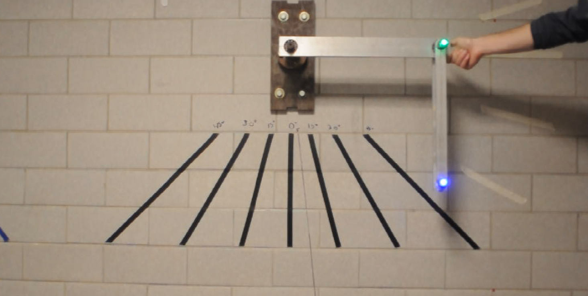

 # Content
- [Overview](#overview)
- [Video Processing](VideoProcessing/README.md)
  - [Motivation](VideoProcessing/README.md#motivation)
    - [Dev Process](VideoProcessing/README.md#dev-process)
      - [Start](VideoProcessing/README.md#start)
      - [Decoding Chaotic Tracking ](VideoProcessing/README.md#decoding-chaotic-tracking)
          - [Color Differentiation](VideoProcessing/README.md#color-differentiation)
          - [Previous Frame Proximity](VideoProcessing/README.md#previous-frame-proximity)
      - [Camera Setting](VideoProcessing/README.md#camera-setting)
  - [How to Use the Code](VideoProcessing/README.md#how-to-use-the-code)
  - [Results](VideoProcessing/README.md#results)
- [Simulation](Simulations/README.md)
  - [Plan](Simulations/README.md#plan)
  - [Mathematical Model](Simulations/README.md#mathematical-model)
    - [Setting up the Lagrangian](Simulations/README.md#setting-up-the-lagrangian)
    - [Euler-Lagrange Equations](Simulations/README.md#euler-lagrange-equations)
    - [Final Equations](Simulations/README.md#final-equations)
  - [The Code](Simulations/README.md#the-code)
    - [Config](Simulations/README.md#config)
      - [Params](Simulations/README.md#params)
        - [Solver](Simulations/README.md#solver)
    - [Equations of Motion](Simulations/README.md#equations-of-motion)
      - [Parameters and State Extraction](Simulations/README.md#parameters-and-state-extraction)
      - [Intermediate Calculations](Simulations/README.md#intermediate-calculations)
      - [Return Value](Simulations/README.md#return-value)
    - [Solve Pendulum ODE](Simulations/README.md#solve-pendulum-ode)
    - [Create Animation](Simulations/README.md#create-animation)
    - [Process Pendulum Data](Simulations/README.md#process-pendulum-data)
    - [Graphing Functions](Simulations/README.md#graphing-functions)
    - [Main](Simulations/README.md#main)
  - [Results](Simulations/README.md#results)
- [Poster](#poster)
- [Credits](#credits)

# Overview  

In Intermediate Physics Laboratory (2025) we have a project to analyze a chaotic pendulum system. This will be done through tracking the angles of a physical set up, making a theoretical model, then comparing the results of the two.  

Here is an image of the physical setup we are working with:  

  
  
Figure 1. Physical Setup.

The MATLAB code given to us for tracking LEDs in a video was broken, old, and quite frankly bad, so we developed a new solution using openCV and other python libraries. See [Video Processing](VideoProcessing/README.md).  

We also used Lagrangians to make a theoretical model, then we simulated the model. See [Simulation](Simulations/README.md).  

If you are a future group doing this lab and hope to code something cool, consider forking this repository!  

# Poster  

Here is an attached image of our poster, to be made.  

# Presentation   

Here we can attach some information on our in class presentation, yet to be created.  

# Credits  

Made by Christopher Pacheco and Adam Field.  
Thank you Professor Noviello and TAs Drew and Holden for all the help.