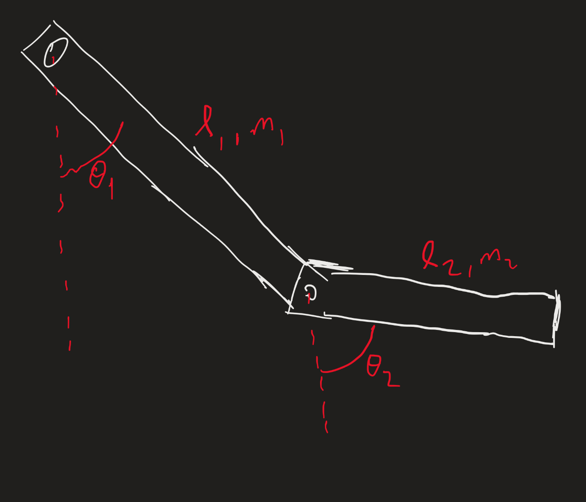

# Content  

- [Plan](#plan)
- [Mathematical Model](#mathematical-model)
    - [Setting up the Lagrangian](#setting-up-the-lagrangian)
    - [Euler-Lagrange Equations](#euler-lagrange-equations)
    - [Final Equations](#final-equations)
- [The Code](#the-code)
    - [Config](#config)
        - [Params](#params)
            - [Solver](#solver)
    - [Equations of Motion](#equations-of-motion)
        - [Parameters and State Extraction](#parameters-and-state-extraction)
        - [Intermediate Calculations](#intermediate-calculations)
        - [Return Value](#return-value)
    - [Solve Pendulum ODE](#solve-pendulum-ode)
    - [Create Animation](#create-animation)
    - [Process Pendulum Data](#process-pendulum-data)
    - [Graphing Functions](#graphing-functions)
    - [Main](#main)
- [Results](#results)

# Plan  
The first step will be to make a mathematical model, the next step will be to research approximation tecniques, then we can code the simulation and see how it turns out! We hope to get graphs out that can be compared to the real world data outputted by the LED tracking program.  
# Mathematical Model  

If you wish to see a neat LaTeX pdf, see [this pdf](../Assets/Mathematical_Model.pdf).  

We started by drawing a diagram to define our system: 

  
  
Figure 3. Defining coordinates of the system.

## Setting up the Lagrangian  

Now we make the expression for position of the center of mass of each pendulum arm:  

$$(x_1,y_1)=\left(\frac{l_1}{2}\sin\theta_1, -\frac{l_1}{2}\cos\theta_1\right)$$  

$$(x_2,y_2)=\left(l_1\sin\theta_1+\frac{l_2}{2}\sin\theta_2, -l_1\cos\theta_1-\frac{l_2}{2}\cos\theta_2\right)$$  

Next, thinking ahead to kinetic energy, let's take the time derivative of these expression:  

$$(\dot{x}_1,\dot{y}_1)=\left(\frac{l_1}{2}\dot{\theta}_1\cos\theta_1,\frac{l_1}{2}\dot{\theta}_1\sin\theta_1\right)$$  

$$(\dot{x}_2,\dot{y}_2)=\left(l_1\dot{\theta}_1\cos\theta_1+\frac{l_2}{2}\dot{\theta}_2\cos\theta_2,l_1\dot{\theta}_1\sin\theta_1+\frac{l_2}{2}\dot{\theta}_2\sin\theta_2\right)$$  

Then the kinetic and potential energy is given by:  

$$T=\frac{1}{6}m_1\left(\dot{x}_1^2+\dot{y}_1^2\right)+\frac{1}{6}m_2\left(\dot{x}_2^2+\dot{y}_2^2\right)$$  

Plugging $\dot{x}$ and $\dot{y}$ we get:  

$$T=\frac{1}{6}m_1\left(\left(\frac{l_1}{2}\dot{\theta}_1\cos\theta_1\right)^2+\left(\frac{l_1}{2}\dot{\theta}_1\sin\theta_1\right)^2\right)$$  

$$+\frac{1}{6}m_2\left(\left(l_1\dot{\theta}_1\cos\theta_1+\frac{l_2}{2}\dot{\theta}_2\cos\theta_2\right)^2+\left(l_1\dot{\theta}_1\sin\theta_1+\frac{l_2}{2}\dot{\theta}_2\sin\theta_2\right)^2\right)$$  

Now expanding the squared sums gives:  

$$T=\frac{1}{24}m_1l_1^2\dot{\theta}_1^2+\boxed{\frac{1}{6}m_2l_1^2\dot{\theta}_1^2\cos^2\theta_1}_A+\frac{1}{6}m_2l_1l_2\dot{\theta}_1\dot{\theta}_2\cos\theta_1\cos\theta_2+\boxed{\frac{1}{24}m_2l_2^2\dot{\theta}_2^2\cos^2\theta_2}_B$$  

$$+\boxed{\frac{1}{6}m_2l_1^2\dot{\theta}_1^2\sin^2\theta_1}_A+\frac{1}{6}m_2l_1l_2\dot{\theta}_1\dot{\theta}_2\sin\theta_1\sin\theta_2+\boxed{\frac{1}{24}m_2l_2^2\dot{\theta}_2^2\sin^2\theta_2}_B$$  

The boxed terms with the same subscript can have their coefficients factored out, and the trig identity $\cos^2+\sin^2=1$ applied to get:  

$$T=\frac{1}{24}m_1l_1^2\dot{\theta}_1^2+\frac{1}{6}m_2l_1^2\dot{\theta}_1^2+\frac{1}{24}m_2l_2^2\dot{\theta}_2^2+\frac{1}{6}m_2l_1l_2\dot{\theta}_1\dot{\theta}_2\left(\cos\theta_1\cos\theta_2+\sin\theta_1\sin\theta_2\right)$$  

Now lets use the following trig identities:  

$$\cos\theta_1\cos\theta_2=\frac{1}{2}\left(\cos(\theta_1+\theta_2)+\cos(\theta_1-\theta_2)\right)$$  

$$\sin\theta_1\sin\theta_2=\frac{1}{2}\left(\cos(\theta_1-\theta_2)-\cos(\theta_1+\theta_2)\right)$$  

To simplify further, giving:  

$$T=\frac{1}{24}m_1l_1^2\dot{\theta}_1^2+\frac{1}{6}m_2l_1^2\dot{\theta}_1^2+\frac{1}{24}m_2l_2^2\dot{\theta}_2^2+\frac{1}{6}m_2l_1l_2\dot{\theta}_1\dot{\theta}_2\cos(\theta_1-\theta_2)$$  

We can also combine the $\dot{\theta}_1^2$ terms to get:  

$$T=\frac{1}{24}(m_1+4m_2)l_1^2\dot{\theta}_1^2+\frac{1}{24}m_2l_2^2\dot{\theta}_2^2+\frac{1}{6}m_2l_1l_2\dot{\theta}_1\dot{\theta}_2\cos(\theta_1-\theta_2)$$  

Now for potential energy: $$V=m_1gy_1+m_2gy_2$$  

$$V=m_1g\left(-\frac{l_1}{2}\cos\theta_1\right)+m_2g\left(-l_1\cos\theta_1-\frac{l_2}{2}\cos\theta_2\right)$$  

Multiplying out the parentheses and combine the $\cos\theta_1$ terms gives:  

$$V=-\frac{1}{2}(m_1+2m_2)gl_1\cos\theta_1-\frac{1}{2}m_2gl_2\cos\theta_2$$  

Now making our Lagrangian ($L=T-V$), we get the following expression:  

$$L=\frac{1}{24}(m_1+4m_2)l_1^2\dot{\theta}_1^2+\frac{1}{24}m_2l_2^2\dot{\theta}_2^2+\frac{1}{6}m_2l_1l_2\dot{\theta}_1\dot{\theta}_2\cos(\theta_1-\theta_2)$$$$+\frac{1}{2}(m_1+2m_2)gl_1\cos\theta_1+\frac{1}{2}m_2gl_2\cos\theta_2$$  

## Euler-Lagrange Equations

$$\frac{d}{dt}\left(\frac{dL}{d\dot{\theta}_1}\right)=\frac{dL}{d\theta_1}$$  

$$\frac{d}{dt}\left(\frac{dL}{d\dot{\theta}_2}\right)=\frac{dL}{d\theta_2}$$  

First let me do $\frac{dL}{d\dot{\theta}_1}$:  

$$\frac{dL}{d\dot{\theta}_1}=\frac{1}{12}(m_1+4m_2)l_1^2\dot{\theta}_1+\frac{1}{6}m_2l_1l_2\dot{\theta}_2\cos(\theta_1-\theta_2)$$  

Now let me do $\frac{d}{dt}\left(\frac{dL}{d\dot{\theta}_1}\right)$:  

$$\frac{d}{dt}\left(\frac{dL}{d\dot{\theta}_1}\right)=\frac{1}{12}(m_1+4m_2)l_1^2\ddot{\theta}_1+\frac{1}{6}m_2l_1l_2\left(\ddot{\theta}_2\cos(\theta_1-\theta_2)-\dot{\theta}_2\sin(\theta_1-\theta_2)(\dot{\theta}_1-\dot{\theta}_2)\right)$$  

Multiplying out the parentheses gives:  

$$\frac{d}{dt}\left(\frac{dL}{d\dot{\theta}_1}\right)=\frac{1}{12}(m_1+4m_2)l_1^2\ddot{\theta}_1+\frac{1}{6}m_2l_1l_2\ddot{\theta}_2\cos(\theta_1-\theta_2)-\frac{1}{6}m_2l_1l_2\dot{\theta}_1\dot{\theta}_2\sin(\theta_1-\theta_2)+\frac{1}{6}m_2l_1l_2\dot{\theta}_2^2\sin(\theta_1-\theta_2)$$  

And now let me do $\frac{dL}{d\theta_1}$:  

$$\frac{dL}{d\theta_1}=-\frac{1}{6}m_2l_1l_2\dot{\theta}_1\dot{\theta}_2\sin(\theta_1-\theta_2)-\frac{1}{2}(m_1+2m_2)gl_1\sin\theta_1$$  

Now setting them equal:  

$$\frac{1}{12}(m_1+4m_2)l_1^2\ddot{\theta}_1+\frac{1}{6}m_2l_1l_2\ddot{\theta}_2\cos(\theta_1-\theta_2)\boxed{-\frac{1}{6}m_2l_1l_2\dot{\theta}_1\dot{\theta}_2\sin(\theta_1-\theta_2)}+\frac{1}{6}m_2l_1l_2\dot{\theta}_2^2\sin(\theta_1-\theta_2)$$$$=\boxed{-\frac{1}{6}m_2l_1l_2\dot{\theta}_1\dot{\theta}_2\sin(\theta_1-\theta_2)}-\frac{1}{2}(m_1+2m_2)gl_1\sin\theta_1$$  

The boxed terms cancel each other giving:  

$$(Eq.\; 1)\qquad\frac{1}{12}(m_1+4m_2)l_1^2\ddot{\theta}_1+\frac{1}{6}m_2l_1l_2\ddot{\theta}_2\cos(\theta_1-\theta_2)+\frac{1}{6}m_2l_1l_2\dot{\theta}_2^2\sin(\theta_1-\theta_2)$$$$=-\frac{1}{2}(m_1+2m_2)gl_1\sin\theta_1$$  

Now for the second Euler-Lagrange equation:  

First let me do $\frac{dL}{d\dot{\theta}_2}$:  

$$\frac{dL}{d\dot{\theta}_2}=\frac{1}{12}m_2l_2^2\dot{\theta}_2+\frac{1}{6}m_2l_1l_2\dot{\theta}_1\cos(\theta_1-\theta_2)$$  

Now let me do $\frac{d}{dt}\left(\frac{dL}{d\dot{\theta}_2}\right)$:  

$$\frac{d}{dt}\left(\frac{dL}{d\dot{\theta}_2}\right)=\frac{1}{12}m_2l_2^2\ddot{\theta}_2+\frac{1}{6}m_2l_1l_2\left(\ddot{\theta}_1\cos(\theta_1-\theta_2)-\dot{\theta}_1\sin(\theta_1-\theta_2)(\dot{\theta}_1-\dot{\theta}_2)\right)$$  

Multiplying out the parentheses gives:  

$$\frac{d}{dt}\left(\frac{dL}{d\dot{\theta}_2}\right)=\frac{1}{12}m_2l_2^2\ddot{\theta}_2+\frac{1}{6}m_2l_1l_2\ddot{\theta}_1\cos(\theta_1-\theta_2)-\frac{1}{6}m_2l_1l_2\dot{\theta}_1^2\sin(\theta_1-\theta_2)+\frac{1}{6}m_2l_1l_2\dot{\theta}_1\dot{\theta}_2\sin(\theta_1-\theta_2)$$  

And now let me do $\frac{dL}{d\theta_2}$:  

$$\frac{dL}{d\theta_2}=\frac{1}{6}m_2l_1l_2\dot{\theta}_1\dot{\theta}_2\sin(\theta_1-\theta_2)-\frac{1}{2}m_2gl_2\sin\theta_2$$  

Now setting them equal:  

$$\frac{1}{12}m_2l_2^2\ddot{\theta}_2+\frac{1}{6}m_2l_1l_2\ddot{\theta}_1\cos(\theta_1-\theta_2)-\frac{1}{6}m_2l_1l_2\dot{\theta}_1^2\sin(\theta_1-\theta_2)+\boxed{\frac{1}{6}m_2l_1l_2\dot{\theta}_1\dot{\theta}_2\sin(\theta_1-\theta_2)}$$  

$$=\boxed{\frac{1}{6}m_2l_1l_2\dot{\theta}_1\dot{\theta}_2\sin(\theta_1-\theta_2)}-\frac{1}{2}m_2gl_2\sin\theta_2$$  

The boxed terms cancel each other giving:  

$$(Eq.\; 2)\qquad\frac{1}{12}m_2l_2^2\ddot{\theta}_2+\frac{1}{6}m_2l_1l_2\ddot{\theta}_1\cos(\theta_1-\theta_2)-\frac{1}{6}m_2l_1l_2\dot{\theta}_1^2\sin(\theta_1-\theta_2)=-\frac{1}{2}m_2gl_2\sin\theta_2$$  

Now we have two equations as follows:  

$$(Eq.\; 1)\qquad\frac{1}{12}(m_1+4m_2)l_1^2\ddot{\theta}_1+\frac{1}{6}m_2l_1l_2\ddot{\theta}_2\cos(\theta_1-\theta_2)+\frac{1}{6}m_2l_1l_2\dot{\theta}_2^2\sin(\theta_1-\theta_2)$$

$$=-\frac{1}{2}(m_1+2m_2)gl_1\sin\theta_1$$  

$$(Eq.\; 2)\qquad\frac{1}{12}m_2l_2^2\ddot{\theta}_2+\frac{1}{6}m_2l_1l_2\ddot{\theta}_1\cos(\theta_1-\theta_2)-\frac{1}{6}m_2l_1l_2\dot{\theta}_1^2\sin(\theta_1-\theta_2)=-\frac{1}{2}m_2gl_2\sin\theta_2$$  

In order to get $\ddot{\theta}_1$ isolated, let me solve for $\ddot{\theta}_2$ in equation 2:  

$$\ddot{\theta}_2=\frac{-\frac{1}{6}m_2l_1l_2\ddot{\theta}_1\cos(\theta_1-\theta_2)+\frac{1}{6}m_2l_1l_2\dot{\theta}_1^2\sin(\theta_1-\theta_2)-\frac{1}{2}m_2gl_2\sin\theta_2}{\frac{1}{12}m_2l_2^2}$$  

Simplifying gives:  

$$\ddot{\theta}_2=-2\frac{l_1}{l_2}\ddot{\theta}_1\cos(\theta_1-\theta_2)+2\frac{l_1}{l_2}\dot{\theta}_1^2\sin(\theta_1-\theta_2)-6\frac{g}{l_2}\sin\theta_2$$  

Now we can plug this expression into equation 1:  

$$\frac{1}{12}(m_1+4m_2)l_1^2\ddot{\theta}_1+\frac{1}{6}m_2l_1l_2\left(-2\frac{l_1}{l_2}\ddot{\theta}_1\cos(\theta_1-\theta_2)+2\frac{l_1}{l_2}\dot{\theta}_1^2\sin(\theta_1-\theta_2)-6\frac{g}{l_2}\sin\theta_2\right)\cos(\theta_1-\theta_2)$$$$+\frac{1}{6}m_2l_1l_2\dot{\theta}_2^2\sin(\theta_1-\theta_2)=-\frac{1}{2}(m_1+2m_2)gl_1\sin\theta_1$$  

We want to solve for $\ddot{\theta}_1$ now so multiplying out the parentheses:  

$$\frac{1}{12}(m_1+4m_2)l_1^2\ddot{\theta}_1-\frac{1}{3}m_2l_1^2\ddot{\theta}_1\cos^2(\theta_1-\theta_2)+\frac{1}{3}m_2l_1^2\dot{\theta}_1^2\sin(\theta_1-\theta_2)\cos(\theta_1-\theta_2)-m_2l_1g\sin\theta_2\cos(\theta_1-\theta_2)$$  

$$+\frac{1}{6}m_2l_1l_2\dot{\theta}_2^2\sin(\theta_1-\theta_2)=-\frac{1}{2}(m_1+2m_2)gl_1\sin\theta_1$$  

Applying the trig identity:  

$$\sin(\theta_1-\theta_2)\cos(\theta_1-\theta_2)=\frac{1}{2}(sin(2\theta_1-2\theta_2))$$  

Gives the simplification:  

$$\frac{1}{12}(m_1+4m_2)l_1^2\ddot{\theta}_1-\frac{1}{3}m_2l_1^2\ddot{\theta}_1\cos^2(\theta_1-\theta_2)+\frac{1}{6}m_2l_1^2\dot{\theta}_1^2\sin(2\theta_1-2\theta_2)-m_2l_1g\sin\theta_2\cos(\theta_1-\theta_2)$$

$$+\frac{1}{6}m_2l_1l_2\dot{\theta}_2^2\sin(\theta_1-\theta_2)=-\frac{1}{2}(m_1+2m_2)gl_1\sin\theta_1$$

Isolating $\ddot{\theta}_1$ gives:  

$$\ddot{\theta}_1=\frac{-\frac{1}{2}(m_1+2m_2)gl_1\sin\theta_1-\frac{1}{6}m_2l_1^2\dot{\theta}_1^2\sin(2\theta_1-2\theta_2)+m_2l_1g\sin\theta_2\cos(\theta_1-\theta_2)-\frac{1}{6}m_2l_1l_2\dot{\theta}_2^2\sin(\theta_1-\theta_2)}{\frac{1}{12}(m_1+4m_2)l_1^2-\frac{1}{3}m_2l_1^2\cos^2(\theta_1-\theta_2)}$$  

We can cancel a $l_1$ from every term and fix the constants to get the final simplified expression:  

$$\ddot{\theta}_1 = \frac{-6(m_1+2m_2)g\sin\theta_1-2m_2l_1\dot{\theta}_1^2\sin(2\theta_1-2\theta_2)+12m_2g\sin\theta_2\cos(\theta_1-\theta_2)-2m_2l_2\dot{\theta}_2^2\sin(\theta_1-\theta_2)}{l_1(m_1+4m_2) - 4m_2l_1\cos^2(\theta_1-\theta_2)}.$$  

Now that we have $\ddot{\theta}_1$ in terms of just the angles and angular velocities, we now can get $\ddot{\theta}_2$ with the equation we made earlier:  

$$\ddot{\theta}_2=-2\frac{l_1}{l_2}\ddot{\theta}_1\cos(\theta_1-\theta_2)+2\frac{l_1}{l_2}\dot{\theta}_1^2\sin(\theta_1-\theta_2)-6\frac{g}{l_2}\sin\theta_2$$  

I'm not too keen on plugging in and simplifying this, but now we have equations for $\ddot{\theta}_1$ and $\ddot{\theta}_2$ in terms of just $\theta_1,\theta_2,\dot{\theta}_1,\text{ and }\dot{\theta}_2$. The final equations are here:  

## Final Equations

$$\ddot{\theta}_1 = \frac{-6(m_1+2m_2)g\sin\theta_1-2m_2l_1\dot{\theta}_1^2\sin(2\theta_1-2\theta_2)+12m_2g\sin\theta_2\cos(\theta_1-\theta_2)-2m_2l_2\dot{\theta}_2^2\sin(\theta_1-\theta_2)}{l_1(m_1+4m_2) - 4m_2l_1\cos^2(\theta_1-\theta_2)}$$ 

$$\ddot{\theta}_2=-2\frac{l_1}{l_2}\ddot{\theta}_1\cos(\theta_1-\theta_2)+2\frac{l_1}{l_2}\dot{\theta}_1^2\sin(\theta_1-\theta_2)-6\frac{g}{l_2}\sin\theta_2$$  

# The Code  

## Config  

Starting with the nested dictionary "CONFIG", this is where we specify the title, the file path for outputs of the simulation, and then the dictionary "params".  

### Params  

The dictionary "params" specifies parameters such as masses, lengths, gravity, initial angles, initial velocities, time span of the simulation, number of points calculated in the simulation, and then the dictionary "solver".

#### Solver  

The dictionary "solver" specifies the method of solving the ode in the method "solve_ivp" in the function "solve_pendulum_ode". The method of solving the ode is "Radau", which is typically used for stiff odes (our ode is stiff). For stiff odes it also helps to have a tight tolerance, which is what "rtol' and "atol" do.  

## Equations of Motion  

The first function of note is the "equations_of_motion" function. This function is responsible for computing the derivatives of the system’s state vector. Here’s a detailed breakdown:  

### Parameters and State Extraction  

Retrieves physical parameters from the "CONFIG" dictionary:  

Masses: "m1" and "m2"  
Lengths: "l1" and "l2"  
Gravity: "g"  

Unpacks the state vector "y", which contains:  

"theta1" and "theta2": Angular positions of the first and second pendulums.  
"omega1" and "omega2": Angular velocities.  

### Intermediate Calculations  

Denominator and Numerator:  

Calculates the numerator and denominator of the big fraction in [Final Equations](#final-equations).  

Angular Accelerations:  

"ddtheta1": This simply does the division in [Final Equations](#final-equations).  

"ddtheta2": Derived partly from "ddtheta1" and includes additional terms seen in [Final Equations](#final-equations).  

### Return Value  

The function returns a list "[omega1, omega2, ddtheta1, ddtheta2]", representing the time derivatives of the state variables.  

## Solve Pendulum ODE

This function sets up and solves the ordinary differential equations (ODEs) that describe the pendulum’s motion from [Final Equations](#final-equations).  

Time Setup:  

Retrieves the time span ("t_span") and creates a series of time points ("t_eval") using "np.linspace".  

Initial Conditions:  

Combines initial angles and angular velocities from the configuration to form the initial state vector "y0".  

ODE Integration:  

Uses SciPy’s "solve_ivp" to integrate the equations defined in "equations_of_motion" over the time span. Solver parameters such as the integration method and tolerance settings are passed via "get_solver_params()".  

Output:  

Returns a solution dictionary containing time points and corresponding state variables.  

## Create Animation

Generates and saves an animated GIF of the pendulum's motion.  

Extract Data:  

Retrieves angular positions ("theta1" and "theta2") and time values from the ODE solution.  

Setup Plot:  

Configures a Matplotlib figure and axes with appropriate limits and aspect ratio.  

Animation Update:  

Defines an "update" function that computes Cartesian coordinates from the angular positions at each frame using "get_cartesian_coords", and then updates the plot.  

Animation Creation:  

Uses "FuncAnimation" to create the animation, and saves it as a GIF file in the output directory specified by "CONFIG['sim_outpath']".  

Output:  

See the gif below:  

  
  
Figure 1. Simulation Output.

## Process Pendulum Data

Processes the ODE solution data to create structured data for each pendulum arm.  

Extract Angles and Time:  
    
Retrieves the time series and angular positions ("theta1" and "theta2") from the solution.  

Convert to Cartesian Coordinates:  
    
Uses the helper function "get_cartesian_coords" to convert angular positions into Cartesian coordinates.  

Data Structuring:  

Iterates over the time points and coordinates to create two lists (one for each pendulum arm) of "PendulumData" (a NamedTuple containing time, angle, and position).  

Output:  
  
Returns a tuple with two lists of "PendulumData" objects, one for each arm.  

## Graphing Functions  

These functions are responsible for visualizing the pendulum’s motion and comparing its behavior over time.  

### plot_angle_comparison  

Plots the angular displacement (converted to degrees) of both pendulum arms as a function of time.  
    - Iterates over the "PendulumData" lists for both arms.  
    - Creates a 2D plot with time on the x-axis and angle on the y-axis.  
    - Adds grid lines, labels, a title, and a legend.  

Output:  

Displays the plot showing a comparison of the angles of the two arms.  See the graph below:  

  
  
Figure 2. Simulation Graph.

### plot_3d_trajectory  

Generates a 3D plot to visualize the spatial trajectory of each pendulum arm over time.  
    - Extracts the x positions and corresponding y positions (using negative y for display) along with the time data.  
    - Uses Matplotlib's 3D plotting capabilities to create a three-dimensional visualization.
    - Labels the axes (X Position, Time, Y Position) and adds a legend.  
Output:  

Displays a 3D plot that shows how each arm’s position evolves over time.  See the graph below:  

  
  
Figure 3. 3D Simulation Graph.

## Main  

Serves as the entry point of the simulation, coordinating the execution of all other functions.  

Solve the ODE:  

Calls "solve_pendulum_ode()" to compute the time evolution of the system.  

Create Animation:  

Generates and saves an animation of the pendulum motion using "create_animation()".  

Process Data:  

Processes the ODE solution data into structured form with "process_pendulum_data()".  

Visualization:  

Calls the graphing functions ("plot_angle_comparison" and "plot_3d_trajectory") to display both 2D and 3D visualizations of the pendulum’s dynamics.  

Output:  

Runs the simulation workflow and produces visual outputs (plots and animation).  

# Results  

The following graph of the motion is outputted:  

  
  
Figure 2. Angle Comparison Graph.

In order to gain confidence in this graph of motion, we also graphed the kinetic, potential and total energy:  

  
  
Figure 4. Energy Analysis.

For a further analysis of the validity of this graph, see [this README](../Verification/README.md).