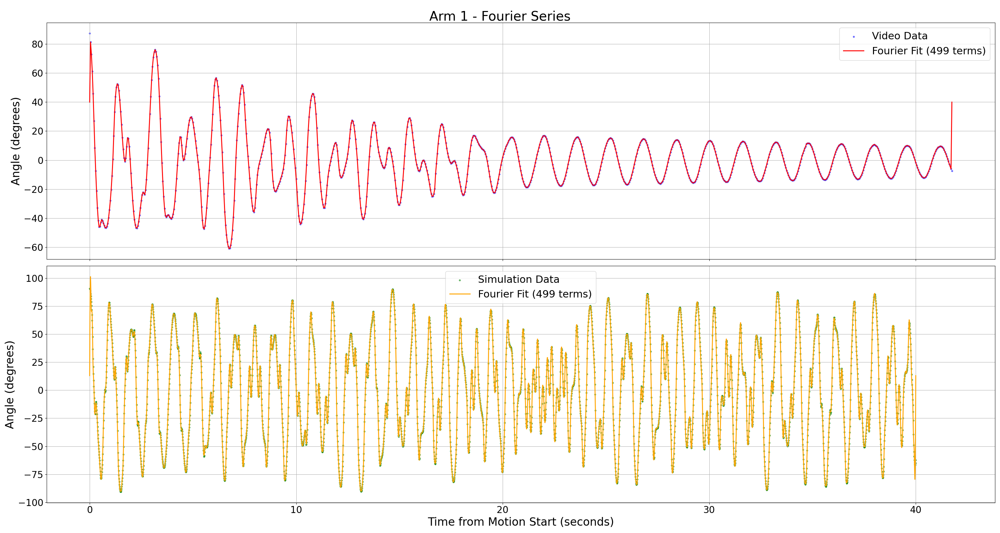
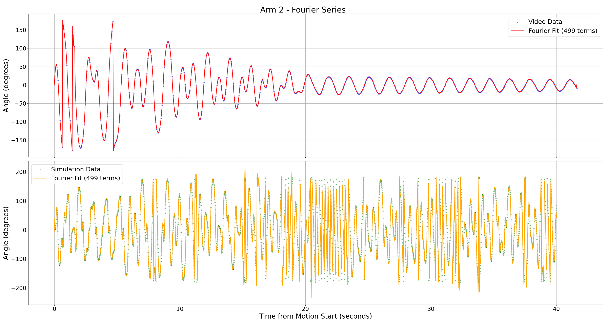

# Content

- [Goal](#goal)
- [The Code](#the-code)
    - [Fourier Functions](#fourier-functions)
        - [fourier_series](#fourier_series)
            - [Parameters](#parameters)
            - [Function Description](#function-description)
        - [fit_fourier](#fit_fourier)
            - [Parameters](#Parameters-1)
            - [Function Description](#function-description-1)
    - [Graphing Functions](#graphing-functions)
        - [plot_fourier_comparison](#plot_fourier_comparison)
        - [plot_deviation](#plot_deviation)
- [Results](#results)

# Goal  

The idea is to find the angular deviation of the simulation from reality. So at every point we want to take the video processing's position and subtract the simulations position, then graph it.  

The hope would be to see a flat portion at the very start (for both arms) then as damping takes over the real system it will deviate from simulation.  

# The Code  

Initially we were just going to take the discrete data saved in .txt files on our local device and subtract them at every time. The issue with this is that the sample rate of the simulation data is different than the frame rate of the video processing data. Comparison proved to be hard using discrete data, so TA Holden helped us come up with an idea to fit a continuous function via Fourier transforms, then take the difference of those.

## Fourier Functions  

It was fast to impliment this in code, adding two functions:  

### fourier_series:  

This function evaluates a Fourier series at specified time points, given the series' coefficients and period. It is designed for users with a background in physics and introductory programming knowledge.

#### Parameters  

  - "t" (np.ndarray): Array of time points where the series is evaluated.
  - "T" (float): Period of the Fourier series. Automatically clamped to a minimum value of `1e-6` to avoid division by zero.
  - "*coefficients": Variable-length coefficients in the order:
  - "a₀" (constant term),
  - "a₁, b₁, a₂, b₂, ..." (coefficients for the cosine and sine terms of increasing harmonic order).

#### Function Description  

The function constructs the Fourier series:  

$$f(t)=a_0 + \underset{\sigma}{n}\left(a_n\cdot\cos(2\pi n \frac{t}{T}) + b_n\cdot\sin(2\pi n \frac{t}{T})\right)$$  

where:  
   - "a₀" is the zeroth coefficient (constant term),
   - "aₙ" and "bₙ" are the coefficients for the "n"-th harmonic cosine and sine terms,
   - "T" is the period of the series.

Note:  
   - Coefficients are provided as "a₀, a₁, b₁, a₂, b₂, ...".
   - Missing coefficients are treated as "0.0". For example, if "coefficients = [a₀, a₁, b₁, a₂]", the "b₂" term is automatically set to "0".
   - If no coefficients are provided, the result is a zero array.

### fit_fourier:  

This function fits a Fourier series to input data "(t, y)" using nonlinear least squares optimization. It returns the fitted coefficients and the evaluated Fourier series at the input time points. Designed for users familiar with signal processing and basic numerical methods.

#### Parameters
  - "t" (np.ndarray): Time points of the input data (1D array).
  - "y" (np.ndarray): Observed data values to fit (1D array, same length as "t").
  - "num_terms" (int, optional): Number of harmonic terms to include in the Fourier series. Default: "10".

Returns:  
  - "Tuple[np.ndarray, np.ndarray]": 
  - First array: Fitted coefficients in the order "[a₀, a₁, b₁, a₂, b₂, ...]".
  - Second array: Fitted values of the Fourier series at the input time points "t".

#### Function Description  

The function performs the following steps:  

1. Period Determination: 
   - The period "T" is set to "t[-1]" (assumes the data spans one full period from "t=0" to "t=T"). 
   - If "t" is empty, "T" defaults to "1.0" to avoid division by zero.

2. Initial Guess:
   - The constant term "a₀" is initialized to the mean of "y".
   - All higher coefficients ("a₁, b₁, a₂, b₂, ...") are initialized to "0.0".

3. Optimization:
   - Uses "scipy.optimize.curve_fit" to minimize the error between the Fourier series (evaluated via "fourier_series") and the data "y".
   - The period "T" is fixed during fitting.
   - The maximum number of function evaluations ("maxfev") is set to "10000" to improve convergence.

## Graphing Functions  

Now we need some way to varify that the Fourier fit is accurately representing the discrete data. Then after that we also want to take the two Fourier fits for each arm and take the difference. These two things make up the graphing functions.  

### plot_fourier_comparison:  

This simply graphs the discrete data as a scatter plot and then plots the Fourier fit on the same graph. 

### plot_deviation:  

This simply takes the Fourier fit for the computer vision angles and subtracts the Fourier fit fro the simlation angles. This gives the deviation from real life of the simulation.  

# Results  

Here we get out the following two graphs for the Fourier fit of each arm data for both the simulation and computer vision data:  

  
  
Figure 1. Arm 1 data (computer vision on top, simulation on bottom).

  
  
Figure 2. Arm 2 data (computer vision on top, simulation on bottom).

And the following angular deviation graph:

  
  
Figure 3. Computer vision Fourier fit minus the sim Fourier fit for both arms.

This is a pretty solid angular deviation graph!  